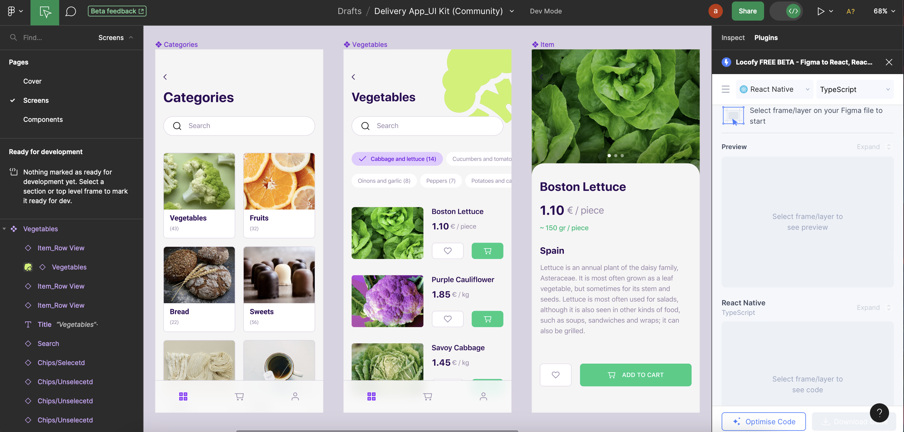
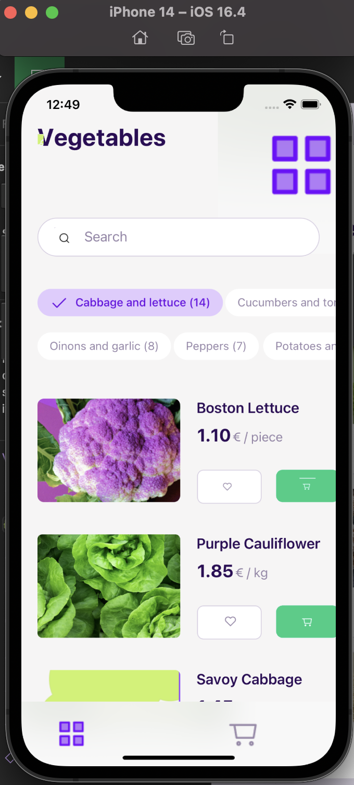

# export-figma-designs-to-react-native-using-locofy
Contains a mobile screen, generated by Locofy's AI, used to test automating exports of Figma designs to React Native code

## Getting Started

### 🔧 Technology Stack
- [Node.js 21](https://nodejs.org/en)
- [Expo](https://expo.dev/client)
- [React Native](https://reactnative.dev)

### Installation (Reference)
```
nvm install 21.0.0
nvm use 21.0.0
yarn create expo -t expo-template-blank-typescript
yarn expo install react-dom react-native-web @expo/webpack-config
yarn expo install @react-navigation/native
yarn expo install @react-navigation/native-stack
yarn expo install expo-image
yarn expo install react-native-screens
yarn expo install react-native-safe-area-context
```

##  Documenting My Experience
Locofy.ai offers a plugin to automate generating React Native code from an initial Figma design. I had the opportunity to test the plugin and document my experience.




Initial Figma Design & AI-Generated React Native Code

As shown above, there is a significant resemblance between the initial design and the outputted code. Locofy correctly generates the layout of the screen, the desired text, and various React Native components, such as the product list and the categories. 

The outputted code provides rudamentary code-splitting, but does not enforce design patterns (e.g. atomic design). 

While Locofy develops the user interface, the expected functionality is missing, such as a scrollable view and pressable components.

Locofy also relies on the developer to perform initial debugging, such as troubleshooting import warnings. 

### External References
- [Exporting Figma designs to React Native: A developer’s guide](https://blog.logrocket.com/exporting-figma-designs-react-native/)

